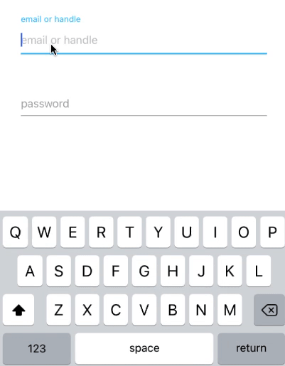

# Animated input
Animated input UI practice with React-Native and typescript

## to start
yarn install for installing all libraries
- for ios: in /ios, `pod install` for installing pod files first, and go back to root folder, type `react-native run-ios` or `npm run ios` for run ios simulator
- for android: if you already installed android studio and sdks, just go to root folder and type `react-native run-android` or `npm run android` for run android sumulator

this is how it looks like

